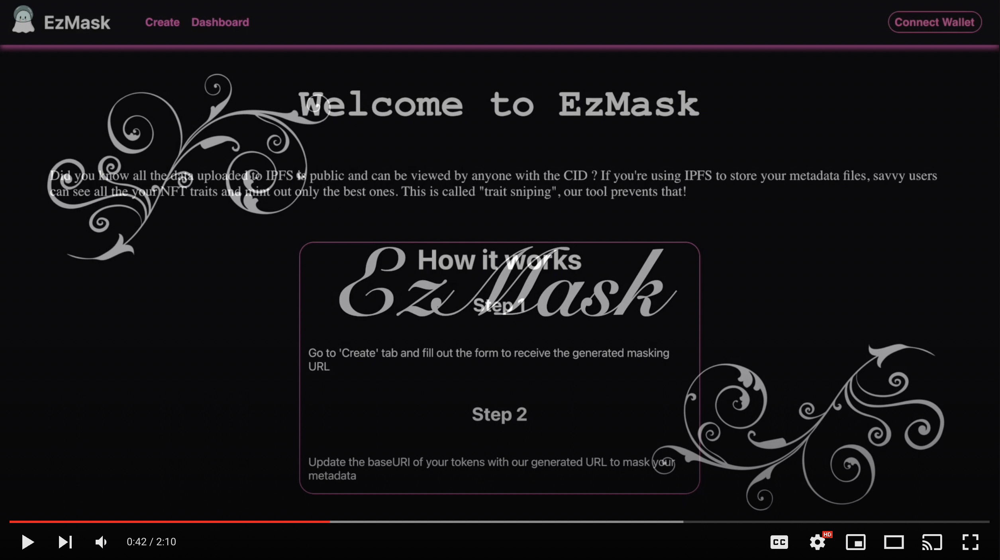
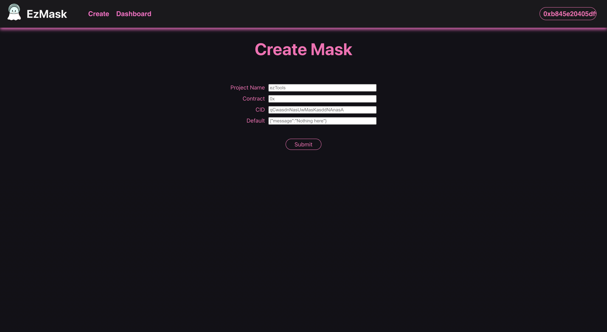

# EzMask

### Demo: Click on the image below

[](https://www.youtube.com/watch?v=0i36L1_Ey4k "Demo Video")

## The Problem

One of the main attack vectors in generative art projects is "trait sniping", since most projects prefer to store their data on IPFS, this means that data is publicly available for anyone to view once they have the CID. <br>
Since projects usually upload their data in iterable directories on IPFS (which is what the contract requires by default), savvy users can easily iterate through the metadata and mint the rarest NFTs.

## Our Solution

EzMask allows you to mask that data using our backend, by simply filling out a form, you'd be able to mask your metadata from potential snipers.



After that you'll receive a mask URL from our backend which can be used as base URI for your token metadata. ITS THAT SIMPLE!

---

How to run ?

For frontend:

```
npm start
```

For backend:

```
node server.js
```

Do note, you'll need mongo db running either on cloud or backend

.env for backend

```
DATABASE_URL = <mongo url>
RPC = <preferred json rpc>
```

---

But this is probably too much work? While this project isn't hosted live yet, you can still reach out to discuss further or ask for a demo on discord: Ace011#5743
